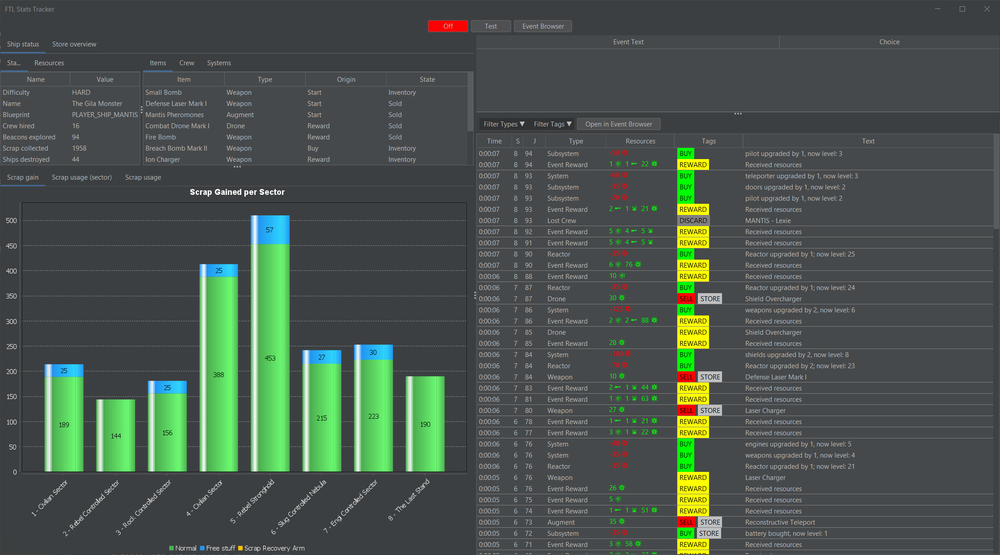
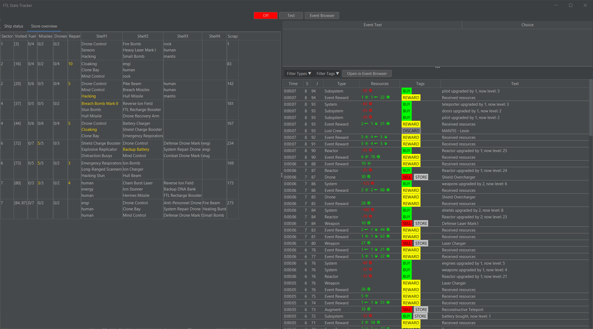

# FTL Stats Tracker

FTL Stats Tracker is a tool that helps you track and analyze your FTL runs. 
It collects information about the run and stores them in a json file.

Here are a few screenshots:

## ⚠️ Disclaimer

FTL Stats Tracker is provided **as-is**. By using this software, you agree that you do so **at your own risk**.  

The developer(s) of this project are **not responsible** for any issues, data loss, or other consequences that may result from using this program.  

Always make sure to **backup your FTL save files** before using the software. Use responsibly.

## 📌 Prerequisites

Before using FTL Stats Tracker, make sure your system meets the following requirement:

- **Java 21 or higher** – Download and install the latest JDK or JRE from [Adoptium](https://adoptium.net/) or [Oracle](https://www.oracle.com/java/technologies/downloads/).

> Ensure that Java is correctly installed and added to your system's PATH so that you can run the program from the command line.

## Credits

This program uses code from [Vhatis ftl-profile-editor](https://github.com/Vhati/ftl-profile-editor)

Big thanks to Vhati and everybody that contributed to that project. The ftl-stats-tracker would not be possible without it.

The referenced code was used under the terms of its original license.

## 📥 How to Use

You can download the **pre-built version** from the [Releases](https://github.com/ejms116/ftl-stats-tracker/releases) page.  

1. Go to the [Releases](https://github.com/ejms116/ftl-stats-tracker/releases) tab.  
2. Download the latest `ftl-stats-tracker-x.y.z.jar` file.  
3. Put the jar into a folder of your choice
4. Run the jar once and close it, now there should be two folders: "runs" and "saves" as well as a ftl-stats-tracker.cfg
5. **Edit the configuration file**  
   Open `ftl-stats-tracker.cfg` with any text editor and configure the following three values (you can use my values as guideline):

   - `ftl_data_path` – the path to your FTL installation folder (the folder containing `ftl.dat`).  
     > On Steam: right-click FTL → Manage → Browse local files.

   - `ftl_save_path` – the path to your FTL save file (not the folder).  
     > If you don’t currently have an active run, this file may not exist.

   - `save_file_copy_setting` – controls how save files are copied:
     - `DISABLED` – save files are not copied.
     - `ONCE_PER_JUMP` – one save file is copied per jump (~80–110 files per run). **Default setting**
     - `ON_EVERY_CHANGE` – a copy is created every time the save file changes (~400 files per run).  
       > ⚠️ Use this only if necessary, as it increases the chance of conflicts between FTL writing the save file and the program reading it.

   > **Hint:** If `save_file_copy_setting` is not `DISABLED`, a new folder will be created for each run inside the `saves` directory.

7. Start the program again and start tracking!

## Usage
- click the red/green button to toggle save file tracking on and off
- if you don't finish your run in one session just start the tracker again and the current run will be loaded (it's the current_run.json in the directory), toggle on the tracking and then continue playing normally

## ✨ Features

FTL Stats Tracker provides detailed insights into your FTL runs, including:

- **Ship Status Reconstruction** – view your ship's crew, systems, items, and resources at any point during a run.  
- **Scrap Analysis** – track scrap gained per sector and overall, and see how efficiently you’re using it.  
- **Store Overview** – see what items were available and purchased in each store.  
- **Event Browser** – search and explore all in-game events and their possible outcomes.  
- **Comprehensive Run Summaries** – analyze your runs in detail to identify patterns and optimize strategies.

## ⚠️ Limitations

FTL Stats Tracker has some inherent limitations due to the way it works:

- **Based on save files** – The program analyzes FTL save files, which are designed to restore the current game state.  
  > Some details are not available, such as whether a player or enemy hit or missed, or which systems they were targeting.

- **Limited inference** – Since the game only writes new save files under certain conditions, it can be difficult to determine exactly what happened in the game just from comparing save files.  
  > For example, scrap can change for many reasons: buying upgrades, event rewards, selling items, or extra scrap from SRA. As a result, some calculations in the program are approximate and can be fragile.

- **Accuracy** – While improvements are ongoing, it is unlikely that 100% accuracy can be achieved.

- **Error-Events** – To reconstruct ship status for every beacon, the program may add "Error-Events" for differences in resources such as scrap, fuel, missiles, or drone parts.  
  > This typically occurs when these values are affected by events during a run.

## Known errors (currently working on)
Here are things that will currently not be tracked correctly

- resource trade events
- missile/drone-part sell event
- crew buy event
- crew sell event (Lanius only iirc)
- weapon buy event
- repair arm scrap difference
- repair events (free or buy)

## Outlook

- I'm currently working on tracking the event choices which can solve most of the issues above
- the tracker already created a json file with all the information included (saved in the runs directory), in the future I want to add statistics for all tracked runs
